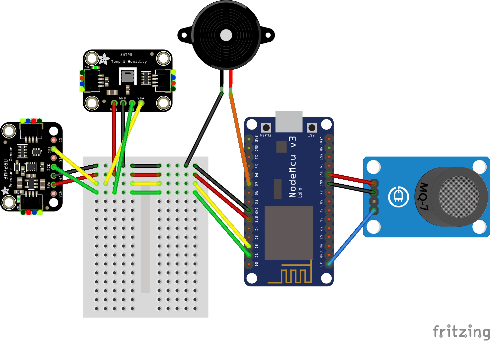

# SmartSenseSketch

## Содержание

[Описание](#description)   
[Принцип работы](#working_principle)  
[Настройка и прошивка](#setup)   
[Полезные ссылки](#useful_links)

---

## Описание

Этот репозиторий является частью проекта SmartSense. Тут представлен скетч для прошивки платы esp8266 nodemcu v3.

Датчики BMP280 и AHT10 (на картинке AHT20) подключены к пинам D1 и D2 по интерфейсу I2C. Датчик угарного газа MQ-7 подключен к аналогову пину A0. Зумер в свою очередь подключен к пину D7. Схема подлючения датчиков и зумера к плате:

---
## Принцип работы
 

Задача данной сборки заключается в получение данных с датчиков и их отпрвку на сервер для последующей записи в базу данных.

Сбор показаний с датчиков происходит каждые две секунды. Каждый раз при получения показаний с датчиков они отпраляются на сервер по протоколу HTTPS. Так же происходит проверка на превышение уровня угарного газа, если данный уровен превышает допустимое значения, то активиззируется зумер. Зуммер будет издавать звук каждые 100 миллисекунд пока значение уграного газа не придет в норму.

---

## Настройка и прошивка
 

---

## Полезные ссылки
